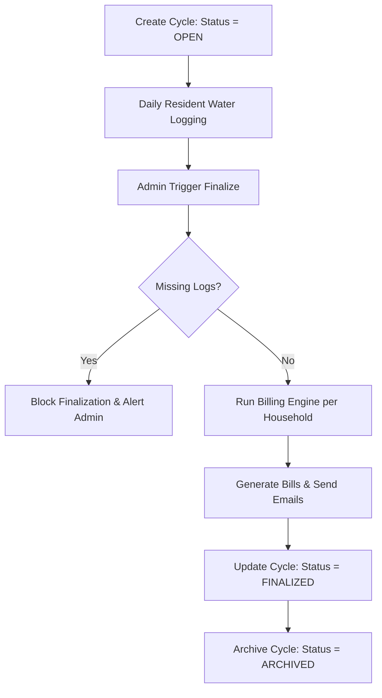

# AquaTrack: Billing Cycle & Engine Architecture Guide

This guide explains how **Billing Cycles** work and how they coordinate water usage logs, tariff policies, shared area costs, and invoice generation in the AquaTrack system.

---

## 1. Overview of the Billing Cycle Lifecycle

A **Billing Cycle** defines the temporal and geographical boundaries for calculating utility costs and issuing bills to residents. 

---

## 2. Phase 1: Creation and Scope Enforcement
Billing cycles can be created by **Super Admins** or **Community Admins**:
* **Super Admins (`ROLE_ADMIN`)** can define global or block-specific cycles across any colony.
* **Community Admins (`ROLE_COMMUNITY_ADMIN`)** are restricted to defining cycles for their assigned **Colony** and **Block** (the UI disables selection, locking it to their local session context).
* **Super Admin Override:** If both a Super Admin and a Community Admin define overlapping cycles for the same colony and block, the **Super Admin's cycle takes precedence** and overrides the Community Admin's cycle at the API layer.

---

## 3. Phase 2: Daily Operations (Water Logging)
Water logging runs independently of billing cycles:
* Residents or admins log daily meter readings (in liters) for individual households.
* These entries are stored as timestamped log records in the database with their respective log dates.
* Because logging is independent, readings are not assigned a cycle ID upon insertion; they are dynamically associated with cycles later based on their timestamp.

---

## 4. Phase 3: Finalization and Billing Calculations
When an admin clicks **"Finalize"** on an `OPEN` billing cycle, the system runs the background billing pipeline:

### Step A: Scope Identification
The system queries all households belonging to the specified colony (`apartmentId`) and block (`apartmentBlock`). If a block is not specified, it executes colony-wide.

### Step B: Water Log Verification
Before calculating bills, the system checks if every household in the scope has logged water usage within the cycle's `startDate` and `endDate`.
* If logs are missing, finalization is blocked.
* The system dispatches a **Water Log Reminder** notification to the block's Community Admin and Super Admin listing the missing households.

### Step C: Shared Area Cost Distribution
The system aggregates block-level or colony-level shared area water usage (e.g., clubhouse, maintenance tanks) within the date range and distributes it among all active households in that scope.

### Step D: Tiered Tariff Evaluation
For each household, the system pulls total logged consumption in liters. It then resolves the tariff rates using the following precedence:

1. **Resident Level:** Check if the individual resident has custom rates defined (`waterRatePerLiter`, `monthlyLimitLiters`, `excessRatePerLiter`).
2. **Community Admin Level:** Fall back to rates configured by their local Community Admin.
3. **System Level:** Fall back to the default property-wide **TariffPlan**.

**Calculation Logic:**
* **Base Usage Charge:** `WithinLimitLiters` $\times$ `BaseRatePerLiter`
* **Excess Usage Charge:** If `TotalLiters > MonthlyLimit`, `(TotalLiters - MonthlyLimit)` $\times$ `ExcessRatePerLiter`
* **Total Cost:** $\text{Base Charge} + \text{Excess Charge} + \text{Shared Area Charge}$

---

## 5. Phase 4: Invoice Generation & Status
Upon successful calculation:
1. **Bill Record Creation:** A `Bill` is saved in the database with status `UNPAID` and linked to the `billingCycleId`.
2. **Notifications:** A notification is posted to the resident's dashboard.
3. **Itemized Emails:** An automated invoice email is dispatched via SMTP with full breakdowns (base rate, limit, excess rate, shared charge, and due date).
4. **Cycle Update:** The cycle status updates to `FINALIZED`, recording the cumulative consumption and total billed amount.
